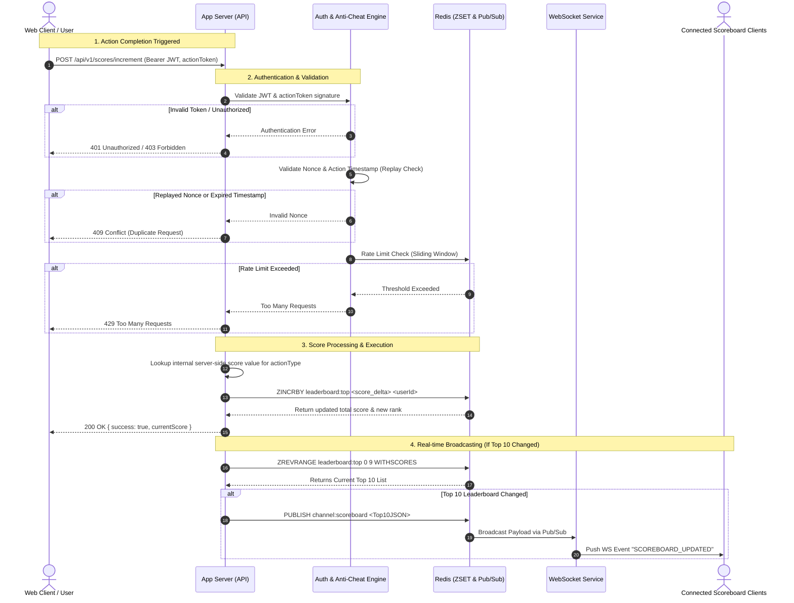

# Live Scoreboard & Score Ingestion Engine Specification

This specification details the design for the Live Scoreboard module on the backend API service. The module handles high-throughput score updates, live top-10 leaderboard distribution via WebSockets, and fraud/tamper prevention to block unauthorized score inflation.

---

## 1. System Architecture & Tech Stack Justification

```
                                 ┌─────────────────────────────────────────┐
                                 │              Web Clients                │
                                 └────┬───────────────────────────────▲────┘
                                      │                               │
                               1. Action API                    4. Live Top 10
                               (POST /scores)                   (WebSocket/WS)
                                      │                               │
                                      ▼                               │
┌─────────────────────────────────────────────────────────────────────┴────┐
│                             API Gateway / App Server                     │
│  ┌────────────────────────┐  ┌───────────────────────┐  ┌──────────────┐ │
│  │ Auth & Fraud Validator │  │ Rate Limiter (Redis)  │  │ WS Manager   │ │
│  └───────────┬────────────┘  └───────────┬───────────┘  └──────▲───────┘ │
└──────────────┼───────────────────────────┼─────────────────────┼─────────┘
               │                           │                     │
               ▼                           ▼                     │
┌────────────────────────────────────────────────────────────────┼─────────┐
│                              In-Memory Engine (Redis)          │         │
│  ┌────────────────────────┐  ┌───────────────────────┐  ┌──────┴───────┐ │
│  │  Idempotency & Rate    │  │  Sorted Set (ZSET)    │  │ Pub/Sub     │ │
│  │  Limiting Store        │  │  `leaderboard:top`    │  │ Channel     │ │
│  └────────────────────────┘  └───────────────────────┘  └───────────────┘ │
└──────────────────────────────────────────┬───────────────────────────────┘
                                           │
                                5. Async Persistence (Batch Write)
                                           │
                                           ▼
                                ┌─────────────────────┐
                                │ Primary Database    │
                                │ (PostgreSQL / SQL)  │
                                └─────────────────────┘

```

### Architectural Decisions ("The Why")

1. **Redis Sorted Sets (`ZSET`) for Score Storage**:
* *Why*: Relational database queries using `ORDER BY score DESC LIMIT 10` become performance bottlenecks under high concurrency. Redis `ZSET` provides $O(\log N)$ time complexity for score insertion/updates (`ZADD` / `ZINCRBY`) and $O(\log N + M)$ for retrieving the top 10 users (`ZREVRANGE`).


2. **WebSocket + Redis Pub/Sub for Live Broadcasts**:
* *Why*: Rather than having clients repeatedly poll the API, the backend maintains persistent WebSocket connections. When a score update alters the top 10 rankings, the application publishes the updated state across a Redis Pub/Sub channel, broadcasting updates to all connected instances.


3. **Decoupled Asynchronous Persistence**:
* *Why*: Writing directly to the primary database on every score increase introduces unnecessary latency. Redis acts as the authoritative hot-path store, while an asynchronous background worker (using BullMQ or Kafka) flushes batched score updates to PostgreSQL for long-term storage.


---

## 2. Anti-Cheat & Security Model

To satisfy Requirement 5 (*"prevent malicious users from increasing scores without authorization"*), client-driven requests containing explicit score increments (e.g., `{ score: +50 }`) are strictly rejected.

### Security Layers

1. **Zero-Trust Score Authority (Server-Side Calculation)**:
* The client **never** specifies the score value. The client sends an signed `actionId` or `actionToken`.
* The server validates the action type and calculates the appropriate score increment internally based on business logic.


2. **Cryptographic Action Proof & Nonces (Replay Protection)**:
* When a user initiates an action, the server generates a short-lived HMAC-signed `actionToken` containing: `{ userId, actionType, timestamp, nonce }`.
* Upon action completion, the client submits this `actionToken`.
* The server verifies the signature, checks that the timestamp is within a valid window (e.g., $< 300$ seconds), and checks Redis to ensure the `nonce` has not been processed.


3. **Atomic Idempotency & Rate Limiting**:
* Requests are limited per user using a Sliding Window algorithm in Redis (e.g., maximum 5 score increments per 10 seconds).
* Nonces are stored atomically via `SET nonce:EXPIRED_TIME EX NX`. If `SET` returns `NULL`, the action is a duplicate replay attempt and is immediately rejected.


---

## 3. Sequence & Execution Flow Diagram



---

## 4. API Interface Specifications

### 1. Increment Score (Action Completion)

* **Endpoint**: `POST /api/v1/scores/increment`
* **Headers**:
* `Authorization`: `Bearer <JWT_TOKEN>`
* `Content-Type`: `application/json`


* **Request Body**:

```json
{
  "actionToken": "eyJhbGciOiJIUzI1NiIsInR5cCI6IkpXVCJ9...",
  "nonce": "c4b3a8e1-5f2d-4b8a-9e3f-1a2b3c4d5e6f"
}

```

* **Response `200 OK**`:

```json
{
  "success": true,
  "data": {
    "userId": "usr_9921",
    "scoreAdded": 10,
    "totalScore": 450,
    "rank": 4
  }
}

```

* **Response Error Codes**:
* `401 Unauthorized`: Missing or invalid JWT token.
* `403 Forbidden`: Invalid or forged `actionToken`.
* `409 Conflict`: Nonce has already been consumed (Replay Attack).
* `429 Too Many Requests`: Action frequency limit exceeded.


---

### 2. Get Current Top 10 (Initial Page Load)

* **Endpoint**: `GET /api/v1/scores/top10`
* **Response `200 OK**`:

```json
{
  "success": true,
  "data": [
    { "rank": 1, "userId": "usr_102", "username": "Alice", "score": 1250 },
    { "rank": 2, "userId": "usr_504", "username": "Bob", "score": 1100 }
  ]
}

```

---

### 3. Live Scoreboard Gateway (WebSocket)

* **Protocol**: `WSS`
* **Endpoint**: `/ws/scoreboard`
* **Connection Handshake**: Client passes Auth token in query param or connection header.
* **Server Push Payload (`SCOREBOARD_UPDATED`)**:

```json
{
  "event": "SCOREBOARD_UPDATED",
  "timestamp": 1773619280,
  "data": [
    { "rank": 1, "userId": "usr_102", "username": "Alice", "score": 1260 },
    { "rank": 2, "userId": "usr_504", "username": "Bob", "score": 1100 }
  ]
}

```

---

## 5. Architectural Trade-offs & Future Improvements

### 1. Redis Memory Management vs. Scale

* **Issue**: Storing millions of users in a single Redis `ZSET` can consume substantial RAM.
* **Improvement**: Implement a **Tiered Leaderboard Architecture**. Keep only active users or users with scores above a threshold (e.g., top 1,000) inside Redis. Store long-tail user scores directly in PostgreSQL, pulling them into the Redis active set only when their score nears the cutoff threshold.

### 2. WebSocket Broadcast Throttling / Debouncing

* **Issue**: Under extreme load (thousands of actions completed per second), publishing updates on every single score change can saturate network bandwidth and cause client rendering stutter.
* **Improvement**: Introduce a **Throttle Buffer (Debouncer)** on the broadcast engine (e.g., max 1 broadcast every 200ms). If 50 updates occur within 200ms, batch them into a single WS event frame containing the latest top 10 snapshot.

### 3. Proof-of-Work / Behavioral Telemetry

* **Issue**: Malicious users may automate API calls using valid JWTs acquired from automated scripts (bots).
* **Improvement**: Integrate a client payload hash (e.g., device fingerprinting, user interaction cadence verification, or reCAPTCHA v3 enterprise score) into the `actionToken` validation pipeline before granting score increments.# Live Scoreboard & Score Ingestion Engine Specification

This specification details the design for the Live Scoreboard module on the backend API service. The module handles high-throughput score updates, live top-10 leaderboard distribution via WebSockets, and fraud/tamper prevention to block unauthorized score inflation.

---

## 1. System Architecture & Tech Stack Justification

```
                                 ┌─────────────────────────────────────────┐
                                 │              Web Clients                │
                                 └────┬───────────────────────────────▲────┘
                                      │                               │
                               1. Action API                    4. Live Top 10
                               (POST /scores)                   (WebSocket/WS)
                                      │                               │
                                      ▼                               │
┌─────────────────────────────────────────────────────────────────────┴────┐
│                             API Gateway / App Server                     │
│  ┌────────────────────────┐  ┌───────────────────────┐  ┌──────────────┐ │
│  │ Auth & Fraud Validator │  │ Rate Limiter (Redis)  │  │ WS Manager   │ │
│  └───────────┬────────────┘  └───────────┬───────────┘  └──────▲───────┘ │
└──────────────┼───────────────────────────┼─────────────────────┼─────────┘
               │                           │                     │
               ▼                           ▼                     │
┌────────────────────────────────────────────────────────────────┼─────────┐
│                              In-Memory Engine (Redis)          │         │
│  ┌────────────────────────┐  ┌───────────────────────┐  ┌──────┴───────┐ │
│  │  Idempotency & Rate    │  │  Sorted Set (ZSET)    │  │ Pub/Sub     │ │
│  │  Limiting Store        │  │  `leaderboard:top`    │  │ Channel     │ │
│  └────────────────────────┘  └───────────────────────┘  └───────────────┘ │
└──────────────────────────────────────────┬───────────────────────────────┘
                                           │
                                5. Async Persistence (Batch Write)
                                           │
                                           ▼
                                ┌─────────────────────┐
                                │ Primary Database    │
                                │ (PostgreSQL / SQL)  │
                                └─────────────────────┘

```

### Architectural Decisions ("The Why")

1. **Redis Sorted Sets (`ZSET`) for Score Storage**:
* *Why*: Relational database queries using `ORDER BY score DESC LIMIT 10` become performance bottlenecks under high concurrency. Redis `ZSET` provides $O(\log N)$ time complexity for score insertion/updates (`ZADD` / `ZINCRBY`) and $O(\log N + M)$ for retrieving the top 10 users (`ZREVRANGE`).


2. **WebSocket + Redis Pub/Sub for Live Broadcasts**:
* *Why*: Rather than having clients repeatedly poll the API, the backend maintains persistent WebSocket connections. When a score update alters the top 10 rankings, the application publishes the updated state across a Redis Pub/Sub channel, broadcasting updates to all connected instances.


3. **Decoupled Asynchronous Persistence**:
* *Why*: Writing directly to the primary database on every score increase introduces unnecessary latency. Redis acts as the authoritative hot-path store, while an asynchronous background worker (using BullMQ or Kafka) flushes batched score updates to PostgreSQL for long-term storage.


---

## 2. Anti-Cheat & Security Model

To satisfy Requirement 5 (*"prevent malicious users from increasing scores without authorization"*), client-driven requests containing explicit score increments (e.g., `{ score: +50 }`) are strictly rejected.

### Security Layers

1. **Zero-Trust Score Authority (Server-Side Calculation)**:
* The client **never** specifies the score value. The client sends an signed `actionId` or `actionToken`.
* The server validates the action type and calculates the appropriate score increment internally based on business logic.


2. **Cryptographic Action Proof & Nonces (Replay Protection)**:
* When a user initiates an action, the server generates a short-lived HMAC-signed `actionToken` containing: `{ userId, actionType, timestamp, nonce }`.
* Upon action completion, the client submits this `actionToken`.
* The server verifies the signature, checks that the timestamp is within a valid window (e.g., $< 300$ seconds), and checks Redis to ensure the `nonce` has not been processed.


3. **Atomic Idempotency & Rate Limiting**:
* Requests are limited per user using a Sliding Window algorithm in Redis (e.g., maximum 5 score increments per 10 seconds).
* Nonces are stored atomically via `SET nonce:EXPIRED_TIME EX NX`. If `SET` returns `NULL`, the action is a duplicate replay attempt and is immediately rejected.


---

## 3. Sequence & Execution Flow Diagram


---

## 4. API Interface Specifications

### 1. Increment Score (Action Completion)

* **Endpoint**: `POST /api/v1/scores/increment`
* **Headers**:
* `Authorization`: `Bearer <JWT_TOKEN>`
* `Content-Type`: `application/json`


* **Request Body**:

```json
{
  "actionToken": "eyJhbGciOiJIUzI1NiIsInR5cCI6IkpXVCJ9...",
  "nonce": "c4b3a8e1-5f2d-4b8a-9e3f-1a2b3c4d5e6f"
}

```

* **Response `200 OK**`:

```json
{
  "success": true,
  "data": {
    "userId": "usr_9921",
    "scoreAdded": 10,
    "totalScore": 450,
    "rank": 4
  }
}

```

* **Response Error Codes**:
* `401 Unauthorized`: Missing or invalid JWT token.
* `403 Forbidden`: Invalid or forged `actionToken`.
* `409 Conflict`: Nonce has already been consumed (Replay Attack).
* `429 Too Many Requests`: Action frequency limit exceeded.


---

### 2. Get Current Top 10 (Initial Page Load)

* **Endpoint**: `GET /api/v1/scores/top10`
* **Response `200 OK**`:

```json
{
  "success": true,
  "data": [
    { "rank": 1, "userId": "usr_102", "username": "Alice", "score": 1250 },
    { "rank": 2, "userId": "usr_504", "username": "Bob", "score": 1100 }
  ]
}

```

---

### 3. Live Scoreboard Gateway (WebSocket)

* **Protocol**: `WSS`
* **Endpoint**: `/ws/scoreboard`
* **Connection Handshake**: Client passes Auth token in query param or connection header.
* **Server Push Payload (`SCOREBOARD_UPDATED`)**:

```json
{
  "event": "SCOREBOARD_UPDATED",
  "timestamp": 1773619280,
  "data": [
    { "rank": 1, "userId": "usr_102", "username": "Alice", "score": 1260 },
    { "rank": 2, "userId": "usr_504", "username": "Bob", "score": 1100 }
  ]
}

```

---

## 5. Architectural Trade-offs & Future Improvements

### 1. Redis Memory Management vs. Scale

* **Issue**: Storing millions of users in a single Redis `ZSET` can consume substantial RAM.
* **Improvement**: Implement a **Tiered Leaderboard Architecture**. Keep only active users or users with scores above a threshold (e.g., top 1,000) inside Redis. Store long-tail user scores directly in PostgreSQL, pulling them into the Redis active set only when their score nears the cutoff threshold.

### 2. WebSocket Broadcast Throttling / Debouncing

* **Issue**: Under extreme load (thousands of actions completed per second), publishing updates on every single score change can saturate network bandwidth and cause client rendering stutter.
* **Improvement**: Introduce a **Throttle Buffer (Debouncer)** on the broadcast engine (e.g., max 1 broadcast every 200ms). If 50 updates occur within 200ms, batch them into a single WS event frame containing the latest top 10 snapshot.

### 3. Proof-of-Work / Behavioral Telemetry

* **Issue**: Malicious users may automate API calls using valid JWTs acquired from automated scripts (bots).
* **Improvement**: Integrate a client payload hash (e.g., device fingerprinting, user interaction cadence verification, or reCAPTCHA v3 enterprise score) into the `actionToken` validation pipeline before granting score increments.